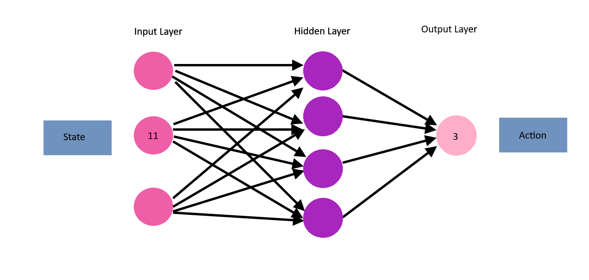
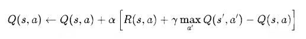

# Deep Q-Learning Snake


A reinforcement learning agent trained to play Snake using Deep Q-Networks (DQN), implemented with Pygame and PyTorch. This repository is based on the tutorial online lesson "Python + PyTorch + Pygame Reinforcement Learning – Train an AI to Play Snake" by freeCodeCamp.org on YouTube.

---

## Game (Pygame)

The environment where the snake game runs. This handles all game mechanics, including movement, collisions, and scoring.

- `play_step(action)`
  - Takes an action as input.
  - Updates the game state based on the action.
  - Returns:
    - `reward`: Feedback for the agent (positive, negative, or neutral).
    - `game_over`: Boolean indicating whether the game has ended.
    - `score`: The current score.

---

## Agent

The decision-maker that interacts with the environment.

- Maintains a reference to:
  - `game`: The Snake game instance.
  - `model`: A neural network used to predict the best action based on the current state.
- Handles:
  - Getting the current state of the game.
  - Choosing an action (with some exploration).
  - Remembering experiences for replay.
  - Training the model on past experiences.

---

## Training Loop

The core reinforcement learning process that improves the agent over time.

```python
state = get_state(game)                       # Extract the current game state
action = get_move(state)                      # Use the model to choose the best action
reward, game_over, score = game.play_step(action)  # Execute the action in the game
new_state = get_state(game)                   # Observe the new state
remember(state, action, reward, new_state, game_over)  # Store the experience
model.train()                                 # Train the model using stored experiences
```

---

## Reinforcement Learning Components

### Reward

The agent receives feedback after every move based on the outcome of its action. These rewards help it learn to make better decisions over time.

- **Eat Food**: `+10`
  - Encourages the agent to seek out food.
- **Game Over**: `-10`
  - Penalises dying (e.g., hitting a wall or itself).
- **Else**: `0`
  - Neutral feedback for all other movements.

This simple reward function guides the agent's learning toward longer survival and higher scores.

---

### Action

The agent's output is a one-hot encoded vector representing the direction of movement relative to its current heading, rather than absolute grid directions.

- `[1, 0, 0]` — **Straight**
- `[0, 1, 0]` — **Turn Right**
- `[0, 0, 1]` — **Turn Left**

This relative encoding approach simplifies directional control into three discrete options that remain consistent regardless of which cardinal direction the snake is actually facing. Whether the snake is going north, east, south, or west, "turn left" always produces the expected behaviour (e.g., north → west, east → north, south → east, west → south).

---

### State

To make informed decisions, the agent needs a numerical representation of the game environment. The state is calculated at each step and passed to the neural network for action prediction.

The state is represented as a list of 11 binary values:

```python
[0, 0, 0,   # danger_straight, danger_right, danger_left
 0, 1, 0, 0,  # direction_left, direction_right, direction_up, direction_down
 0, 1, 0, 1]  # food_left, food_right, food_up, food_down
```

This vector asserts that there is no wall nearby, the snake is moving right, and that food is both down and right.

---

### Model

The model is a simple feedforward neural network with:

- **Input layer**: 11 neurons — one for each value in the state vector.
- **Hidden layer**: A single hidden layer (configurable size).
- **Output layer**: 3 neurons — one for each possible action (straight, right, left).



The output represents Q-values for each action, and the agent selects the action with the highest predicted value.


---

### Deep Q-Learning

**Q-value** = Quality of an action in a given state.

This project uses **Deep Q-Learning (DQN)**, a reinforcement learning algorithm that combines Q-learning with deep neural networks.

In traditional Q-learning, an agent uses a Q-table to map state-action pairs to expected future rewards. However, this approach becomes impractical in environments with large or continuous state spaces. Enumerating all possible states in a Q-table would require enormous amounts of memory and time.

DQN overcomes this by using a neural network to approximate the Q-function:

```python
Q(state, action) ≈ model(state)[action]
```

This means the model outputs a vector of Q-values (one per action) given a state, and the agent selects the action with the highest predicted value.

```python
output = [2.5, 1.2, 0.3]  # Q-values for [Straight, Turn Right, Turn Left]
```

In this example:

2.5 for going straight,

1.2 for turning right,

0.3 for turning left.

The agent will select the action corresponding to the highest Q-value, which here is **going straight**.

**Steps**

*Training consists of one-time setup followed by repeated learning cycles.*

1. Initialise Q-Values (i.e. initialise the mode and any buffers).
2. Execute iterative training loop:
   
   - Choose action `(model.predict(state))` (or random move).
   - Perform the action in the environment.
   - Receive reward and observe the next state.
   - Update Q-value and train the model on the experience.

**Loss Function**

This implementation employs a Deep Q-Network (DQN) architecture designed to minimise the temporal difference error between predicted Q-values and target Q-values computed using the Bellman optimality equation. The loss function uses Mean Squared Error (MSE) to quantify the difference between the network's current Q-value predictions and the target values, driving the learning process through backpropagation.



**Where:**

- α: Learning rate coefficient controlling the magnitude of parameter updates
- γ: Discount factor determining the relative importance of future rewards (0 ≤ γ ≤ 1)
- s: Current state observation
- a: Action selected in the current state
- s': Subsequent state reached after executing action a in state s
- Q(s,a): Current approximation of the action-value function for state-action pair (s,a)
- R(s,a): Immediate reward obtained from executing action a in state s
- Q_target(s',a'): Target network's estimate of the optimal action-value for the next state s' and action a'
- max Q_target(s',a'): Maximum expected future reward from state s', representing the optimal policy's value estimate

The model employs experience replay to sample training batches from stored experience tuples of the form (s, a, r, s'). The temporal difference error serves as the basis for computing the loss function, which drives parameter updates in the main Q-network.

To enhance training stability, the implementation utilises a separate target network Q_target with parameters that are periodically synchronised with the main network. This approach reduces the correlation between target values and current predictions, thereby mitigating harmful oscillations during the learning process.

**Simplified** — In short, this rule can be understood as:
  - `Q = model.predict(state₀)`
  - `Q_new = R + (γ * max(Q(state₁)))`  
Where the loss function is a mean squared error:
  - `loss = (Q_new — Q)²`


---

